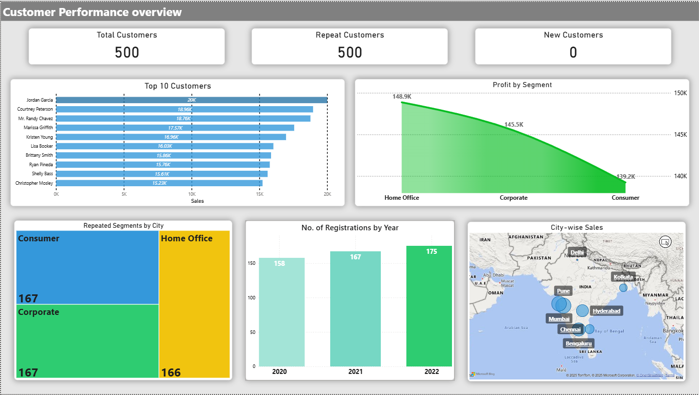
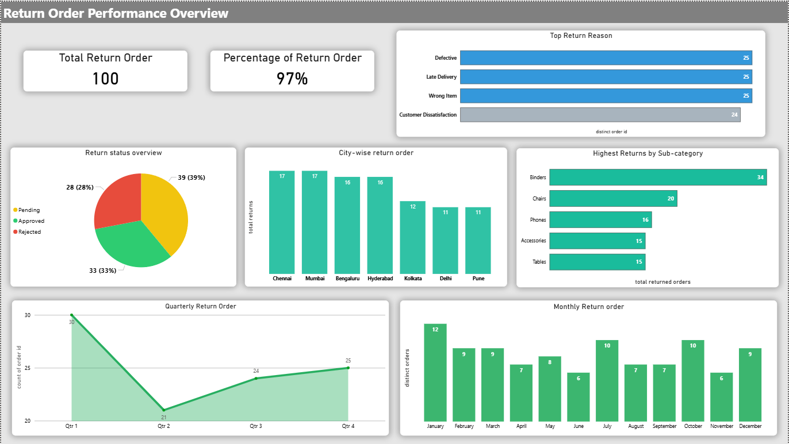

# 📊 Power BI Business Intelligence Dashboards  
**Customer • Order • Return Analysis**

## 🔍 Project Snapshot
- **Tool:** Power BI  
- **Core Skill:** Business-focused dashboarding with DAX  
- **Deliverable:** 3 interactive dashboards built from 3 datasets  
- **Context:** Created and presented live after completing the Power BI module in coaching  
- **Outcome:** Appreciated by the trainer for clarity of insights, KPIs, and presentation  

This project highlights my ability to **analyze business problems, build dashboards, and clearly present insights**, not just create visuals.

---

## 💼 Why This Project Matters
- Strong understanding of **business KPIs**
- Hands-on **DAX measure creation**
- Ability to **convert raw data into insights**
- Experience **presenting dashboards** to an audience
- Practical analysis of **sales, profit, discounts, and returns**

---

## 📈 Dashboards Overview

### 1️⃣ Customer Performance Dashboard
**Objective:** Analyze customer behavior and growth patterns  

**Key KPIs**
- Total Customers  
- Repeat Customers  
- New Customers  

**Key Insights**
- 500 total customers, all repeat → no new customer acquisition  
- Indicates stagnant business growth  
- Identified top customer by sales contribution  
- Segment-wise and city-wise customer distribution analysis  

---

### 2️⃣ Order Performance Dashboard
**Objective:** Evaluate sales efficiency, profitability, and discounts  

**Key KPIs**
- Total Orders: 1000  
- Total Sales: 2.46M  
- Total Profit: 433.6K  
- Profit Margin: 17.63%  

**Key Insights**
- 57% repeat orders (positive retention signal)  
- High discount impact reducing net profitability  
- Technology category most profitable, Furniture lowest  
- Q2 & Q4 strongest quarters  
- Hyderabad highest sales, Kolkata lowest  

---

### 3️⃣ Return Analysis Dashboard
**Objective:** Identify quality and operational issues  

**Key KPIs**
- Total Returned Orders  
- Percentage of Returned Orders  

**Key Insights**
- 97% return rate → major product or process issue  
- Top return reasons: Defective, Late Delivery, Wrong Product  
- 39% returns pending approval  
- Chennai & Mumbai highest returns  
- Binders and Chairs most returned sub-categories  

---

## 🧮 DAX Measures Created
- Total Customers  
- Repeat Customers  
- New Customers  
- Total Sales  
- Total Orders  
- Discount Impact  
- Discount Impact Percentage  
- Repeat Order Percentage  
- Returned Order Percentage  

(All measures created manually using DAX)

---

## 🛠 Tools & Technologies
- Power BI  
- DAX  
- PowerPoint (for presentation)  
- Data range: 2023–2024  

---

## 🚀 What This Project Demonstrates
- Business-oriented data analysis  
- Strong Power BI fundamentals  
- KPI-driven dashboard design  
- Clear data storytelling and presentation skills  

---
