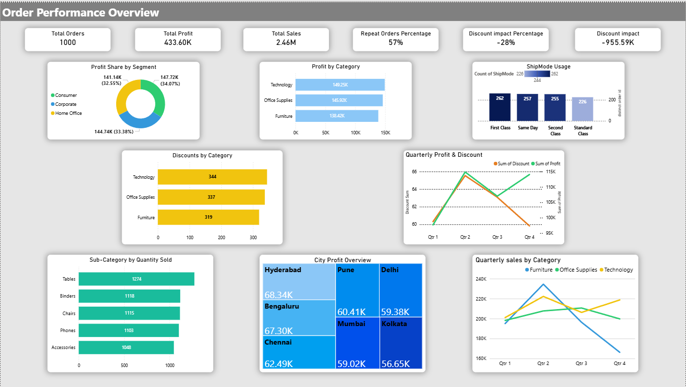

# 📊 Power BI Business Dashboards

## 🧠 Project Overview
This repository contains **three business-focused Power BI dashboards** built using real-world datasets and presented live after completing the Power BI module during coaching.

The project demonstrates my ability to **analyze business data, build dashboards using DAX, and clearly present insights**, not just create visuals.

---

## 📈 Dashboards

### 👥 1️⃣ Customer Performance Dashboard
Analyzes customer behavior, repeat vs new customers, and segment-wise distribution to understand business growth.

---

### 📦 2️⃣ Order Performance Dashboard
Evaluates sales, profit, discount impact, shipping behavior, and quarterly performance to assess overall business health.

---

### 🔁 3️⃣ Return Analysis Dashboard
Identifies return patterns, major return reasons, affected cities, and product categories to highlight quality and operational issues.

---

## 🛠️ Tools & Skills Used
- 🧩 Power BI  
- 🧮 DAX  
- 🗂️ Data Modeling  
- 📊 Business KPI Analysis  
- 🎯 Dashboard Presentation  

---

## 🚀 Key Skills Demonstrated
- Business-oriented data analysis  
- KPI-driven dashboard design  
- DAX measure creation  
- Clear data storytelling and presentation  
